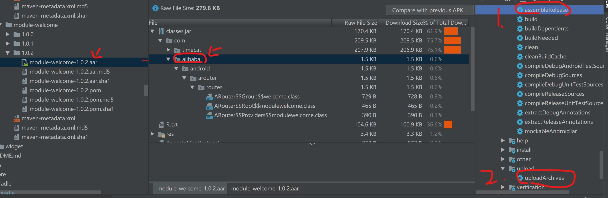
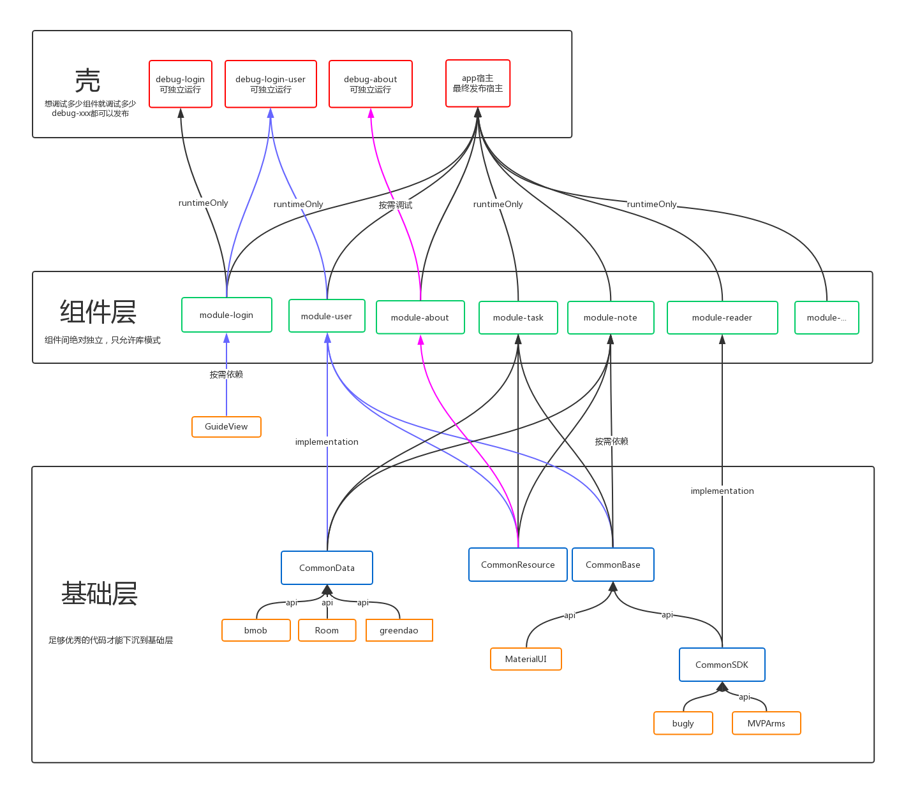

# 用生命周期规范组件化流程

目录
=================
* [写在前面](#写在前面)
* [1. 组件创建](#1-组件创建)
   * [从原有代码中拆分出的新组件](#从原有代码中拆分出的新组件)
   * [为新功能创建新组件](#为新功能创建新组件)
      * [新功能的确定](#新功能的确定)
      * [新组件架构的确定](#新组件架构的确定)
      * [新组件架构的创建傻瓜化](#新组件架构的创建傻瓜化)
* [2. 组件开发](#2-组件开发)
   * [组件调试时独立](#组件调试时独立)
   * [多组件调试](#多组件调试)
   * [组件开发](#组件开发)
   * [组件耦合](#组件耦合)
      * [组件间数据传递](#组件间数据传递)
      * [组件间函数调用](#组件间函数调用)
      * [组件间界面跳转](#组件间界面跳转)
            * [构建标准的路由请求](#构建标准的路由请求)
            * [处理路由请求](#处理路由请求)
            * [ARouter 搞不定的情况](#arouter-搞不定的情况)
      * [组件间 UI 混合](#组件间-ui-混合)
* [3. 组件维护](#3-组件维护)
   * [组件混淆](#组件混淆)
   * [体积优化](#体积优化)
      * [assets 优化](#assets-优化)
      * [res 优化](#res-优化)
      * [lib目录优化](#lib目录优化)
      * [清除无用的资源文件](#清除无用的资源文件)
      * [清除未使用的替代资源](#清除未使用的替代资源)
      * [整理代码](#整理代码)
   * [编译加速（gradle 优化）](#编译加速gradle-优化)
   * [依赖控制](#依赖控制)
   * [发布 aar](#发布-aar)
   * [常见错误：already present](#常见错误already-present)
* [4. 组件发布](#4-组件发布)
* [5. 组件移除](#5-组件移除)
* [6. 组件划分](#6-组件划分)
   * [架构](#架构)
      * [宿主壳、调试壳](#宿主壳调试壳)
      * [组件层](#组件层)
      * [基础层](#基础层)
      * [MVC、MVP、MVVM 如何下沉](#mvcmvpmvvm-如何下沉)
   * [Utils 规范：使用 Kotlin](#utils-规范使用-kotlin)
      * [静态方法](#静态方法)
      * [单例模式](#单例模式)
   * [res 规范：命名清晰](#res-规范命名清晰)
      * [string.xml](#stringxml)
   * [asset](#asset)
   * [特殊组件](#特殊组件)
      * [CommonResource](#commonresource)
      * [CommonData](#commondata)
      * [CommonBase](#commonbase)
      * [CommonSDK](#commonsdk)
* [写在后面](#写在后面)
   * [展望：组件共享](#展望组件共享)
   * [尾声](#尾声)

## 写在前面

[demo 有空会在 github 上更新，欢迎关注](https://github.com/LinXueyuanStdio/lifecycle-component)。

> 本文是在我重构个人项目时光猫的时候，边组件化边记录下来的。期中踩了很多坑，也不断思考优雅的解决方案。因为是个人项目，所以可以随便浪，可以毫无保留地公布细节，应该还是有指导意义的。

> 一开始我是按最流行的组件化方案来做，但是在重构的过程中发现，最流行的未必是最好的。比如流行方案里会有 common 基础库，各个组件需要依赖这个库。这样实际上很糟糕。由于没有明确 common 的职责，会慢慢导致臃肿，什么代码都 feel 一下，感受感受，诶，下沉到 common 库。这会极大影响组件的编译时间。实际上，我刚组件化完成的时候，这种方案并没有带来很大的效率提升，甚至更慢了，调试一次先等 10 分钟，以前只要等 5 分钟诶。虽然是五十步笑百步，但 10 分钟真的难受。然后是组件可以切换独立模式和库模式这个设定。一开始很惊艳，但是用了后体验很糟糕。原来我的项目里有 `butterknife`，每次切换都要大改很麻烦，因为`butterknife`在组件库模式和独立模式下的用法不统一，独立模式用`R.id.xxx`，库模式用`R2.id.xxx`，侵入太大。还有很多做法，比如每个组件两份 `AndroidManifest.xml` 、组件发布为 aar 等等，有些是没有和博客中说的有实实在在的效率提升，有些根本没有必要。最终我按我的想法，把组件化流程慢慢规范化，明确了组件化的内容和边界，才有这篇文章。我的项目时光猫经历组件化后，单个大组件（3w+行代码）全量编译 ~10 分钟，增量编译（调试一次）~1 分钟，单个小组件（1w-行代码）全量编译<3分钟，增量编译<30秒，满足开发的效率需要。当然，秒编译秒执行也是可以做得到的。如果有精力把基础层更细化一点，编译效率应该还可以提升。

在实现组件化的过程中，同一个问题可能有不同的技术路径可以解决，但是需要解决的问题主要有以下几点：

1. `组件调试时独立`：每个组件都可以成为一个可发布的整体，所以组件开发过程中要满足单独运行及调试的要求，这样还可以提升开发过程中项目的编译速度。

2. `组件间数据传递和函数调用`：数据传递与组件间方法的相互调用，这也是上面我们提到的一个必须要解决的问题。

3. `组件间界面跳转`：不同组件之间不仅会有数据的传递，也会有相互的页面跳转。在组件化开发过程中如何在不相互依赖的情况下实现互相跳转？

4. `组件间 UI 混合`：主项目不直接访问组件中具体类的情况下，如何获取组件中 Fragment 的实例并将组件中的 Fragment 实例添加到主项目的界面中？View 呢？

5. `组件的按需依赖`：组件开发完成后，全部集成如何实现？还有就是在调试阶段，只想依赖几个组件进行开发调试时，如果实现？

6. `组件隔离与代码隔离`：组件解耦的目标以及如何实现代码隔离。不仅组件之间相互隔离，还有第五个问题中模块依赖组件时可以动态增删组件，这样就是模块不会对组件中特定的类进行操作，所以完全的隔绝模块对组件中类的使用会使解耦更加彻底，程序也更加健壮。

7. `组件混淆与体积优化`：组件化意味着重构，如果重构后还要加大量代码维持组件化，导致体积变大，岂不是要被打？

8. `特殊组件标准化`：明确定义某些固定的职责和边界，以期望**不用带脑子**就可以直接往这些特殊组件内丢代码，不用担心变垃圾堆。

上面 8 个问题实际上并不能覆盖所有情况，大大小小的坑很多，不成系统。

现在，我提议把它们放到`组件化生命周期`里，初步构建一个成体系的组件化指导。

为什么从生命周期这个角度切入？

首先，明确组件的生命周期可以减少开发过程中，由于需求变化带来的隐形时间成本。比如老板说要在现在的视频 app 里加个直播功能，你是新建一个 git 分支，然后在原视频组件里写，还是新建一个组件写？ok，现在老板脑子有坑，你刚把 demo 做出来，老板说不做了？！你怎么办？得废弃掉这个分支吧。ok，过了两个月，视频组件发展起来，以前的界面和现在的界面不一样了，现在老板突然说再加个直播吧。这时以前写的 demo 还在，但是如果是直接在视频组件里写的，现在不能用，修改过来绝对费事；而如果是新建组件写的，直接像引入第三方库一样就行了。哪个简单？

本文的定义里，组件和第三方库是类似的。

对于第三方库，我们需要`引入第三方库`，`使用第三方库`，觉得不好用会`移除第三方库`。这些过程大多时候是无意识之间完成的，一般看文档做，文档写得乱就栽了。而且通常情况下，移除第三方库是没有说明的。移除的时候不仅按引入第三方库的说明，删除掉引入部分，还要看项目在哪里用了这个库，删掉这个库会不会崩等等，很麻烦。

组件也要经历类似的生命周期，不过组件的生命周期更简单，也容易掌控，因为组件间隔离解耦。每个组件可以有自己的数据库，可以有自己的架构等等，基本是一条龙服务，和重新写个 app 区别不大（如果你的组件不能成为一个独立的app，那这个组件也许没有必要单独做）。

其次，组件化不是一下子完成的，它需要漫长的时间。这时组件划分尤为重要。什么时候把这个功能拆出去？什么时候合进来？什么时候加新功能？怎么加新功能？怎么确保组件化的同时业务正常跑？怎么不浪费时间在组件化上？怎么确定这样划分组件是相对好的？问题在于，事物是不断发展的，现在的架构也许还能用，过一两个月就可能成垃圾堆了（深有体会）。所以组件划分是生命周期的重要组成部分。

面向生命周期的组件设计，需要明确组件创建，组件开发，组件发布，组件移除，组件划分，组件维护的一整套操作规范。下面将就这套体系一一详细分析原因和给出解决方案。

## 1. 组件创建

创建一个组件，有两个来源。一是拆分而来创建的新组件，二是为新功能创建一个新组件。

### 从原有代码中拆分出的新组件

有这些场景：

1. 以前是所有代码都写在 `app/` 里一把梭的话，首先要把里面代码全部拉出来新建一个组件，然后再以`组件划分`的规范逐步处理。
2. 以前是组件划分不规范，现在重新划分出新组件。
3. 以前是组件下沉不规范，现在从基础层重新认领代码，形成新组件。

所以对应有三种情况，

1. 旧代码在壳里`apply plugin: 'com.android.application'`
2. 旧代码在组件层里`apply plugin: 'com.android.library'`
3. 旧代码在基础层里`apply plugin: 'com.android.library'`

这 3 种情况按`组件划分`的规范处理旧代码。然后按下面`为新功能创建新组件`的规范新建组件。

### 为新功能创建新组件

要明确两个部分：新组件功能是什么？新组件用什么架构？

#### 新功能的确定

首先，新组件功能不能与已有的组件功能100%相同，否则这不是新功能。
其次，新组件功能可以与已有组件功能交互，但不能有重合。
最后，新组件功能的划分要保持粒度一致。一个组件一个 Activity 是允许的，只要划分的粒度和其他组件的粒度保持一致。即，类比于化学，划分到元素，就氢，氦，锂，铍，硼这样划，不要划什么电子，也不要划什么氧分子，粒度要保持在元素这一层。然后，像这种一个 Activity 的轻量级组件，推荐发布为 aar。

#### 新组件架构的确定

常用有三种架构：MVC、MVP、MVVM。按需求选择即可，组件间独立，架构不一样是允许的。

如果是前端过来的同学，推荐 MVVM，如果是传统 Android 开发，则推荐 MVP。

#### 新组件架构的创建傻瓜化

使用模板或 AS 插件实现。

这里推荐 [JessYanCoding 的 `MVPArms 框架`](https://github.com/JessYanCoding/MVPArms)，结合 [`ArmsComponent`](https://github.com/JessYanCoding/ArmsComponent)。`MVPArms` 一系提供了 `ArmsComponent-Template` (Module 级一键模板) 一键搭建整体组件架构,  `MVPArmsTemplate` (页面级一键模板) 一键生成每个业务页面所需要的 MVP 及 Dagger2 相关类。通过模板工具的方式统一架构，方便快捷。新建过程不用过多浪费时间在架构的维护上，按着 MVP 莽就是了~

目前我没发现有提供模板工具的其他架构，但也许有了我没发现也说不定？欢迎补充！

PS：官方 MVVM 架构应该可以整个模板出来...

PPS：[JessYanCoding 的 `MVPArms 框架`](https://github.com/JessYanCoding/MVPArms)整合了常用第三方库，墙裂推荐！


## 2. 组件开发

### 组件调试时独立

！！！禁止切换为独立模式！组件只允许`库模式`！

现在组件化很流行的做法是把组件划分为库模式和独立模式，在开发时使用独立模式，在发布时使用库模式。比如说，`gradle.properties`中定义一个常量值 isPlugin（是否是独立模式，true为是，false为否）然后在各个组件的`build.gradle`中这么写：
```
if (isPlugin.toBoolean()) {
    apply plugin: 'com.android.application'
} else {
    apply plugin: 'com.android.library'
}
```

但是，这没必要。

至少有四点原因，足以使你放弃切换这种模式。

1. 可靠性问题。注意开发时和发布时开发者面对的组件其实是不一样的。多个组件一起发布打包时经常出现依赖冲突等毛病，和开发时不一样，浪费时间。
2. 切换代价。要同时调试两个组件之间的通信，往往要频繁切换库模式和独立模式，每次都`Gradle Sync`一次，代价极大。
3. 第三方库。比如`ButterKnife`，切换组件成库模式和独立模式的过程中，`ButterKnife`可能导致切换失败，因为库模式用`R2`和独立模式用`R`，侵入性极大。
4. 维护代价。由于有两个模式，需要维护两份`AndroidManifest.xml`，里面细节差异很大。

设立这两种模式的初衷在于组件解耦和敏捷开发，这就是一句笑话。

为解决这个问题，制定规范如下：

- 组件只允许`库模式`！
- 在库模式的基础上套一个空壳，以间接实现组件的独立模式。
- 第三方库统一按库模式来。组件中`ButterKnife`统一使用 `R2`，不得使用`R`。原来使用`R`的，请`ctrl+shift+R`全局替换，用正则表达式替换成 `R2`。
- 壳只由两个个文件构成。`build.gradle`和`AndroidManifest.xml`

  改下`build.gradle`声明塞进哪些组件，改`AndroidManifest.xml`声明入口Activity（其他Activity的声明只要在组件内声明，Build 时会合并进去）

  事实上，壳可以写个模板文件夹，需要的时候复制粘贴即可。

  可以在`build.gradle`里声明`AndroidManifest.xml`放在同一级目录下，不用创建多余的文件夹。

好处：

1. 可靠性问题。开发者面对的只有库模式，最终打包的也是库模式的组件。（只用`apply plugin: 'com.android.library'`）
2. 切换代价。用套壳的方式间接实现独立模式来调试组件，极为灵活。
   - 可以一个组件一个壳，两个组件一个壳，想调试多少组件就把它们都塞进一个壳。
   - 切换壳的过程不需要 `Gradle Sync`，直接指定哪个壳直接 `Build` 就行
3. `ButterKnife`。老项目肯定广泛使用了`ButterKnife`，在组件化时，一次修改，永久有效（只需`R`改成`R2`），不像前面切换两个模式时，需要同时切换`R`和`R2`
4. 维护代价。只用维护库模式的组件。空壳随意维护一下就行，反正没有java或kotlin之类的代码。

### 多组件调试

因为组件只允许库模式，所以需要创建空壳，间接实现独立模式，以供调试。

壳只由两个个文件构成。`build.gradle`和`AndroidManifest.xml`。`build.gradle`声明塞进哪些组件，`AndroidManifest.xml`声明入口Activity（其他Activity的声明只要在组件内声明，`Build` 时会合并进去）

> 事实上，壳可以写个模板文件夹，需要的时候复制粘贴即可。可以在`build.gradle`里声明`AndroidManifest.xml`放在同一级目录下，不用创建多余的文件夹。

可以一个组件一个壳，两个组件一个壳，想调试多少组件就把它们都塞进一个壳。切换壳的过程不需要 `Gradle Sync`，直接指定哪个壳直接 `Build` 就行

### 组件开发

组件是完整又独立的个体，组件内允许建自己的数据库，不必下沉到基础层。

尽量复用基础层，比如继承 Base 系列，布局 include base 系列的 layout 等等。

允许 implementation 的形式引入组件自己的依赖，注意使用 `gradle dependencies` 查看依赖树，确定是否和其他组件依赖冲突。

允许多个架构共存。比如这个组件 MVC，那个组件 MVP，那个组件 MVVM。不过还是建议统一一下。我目前个人项目里这 3 种组件都有，同时维护，好像也不费劲...不过公司的一般有人事变动，统一架构更有利于沟通。

组件内的生命周期注入：组件需要在 Application 创建时初始化数据库等，如何统一注入到 Application 的生命周期里呢？
还是推荐 MVPArms，支持 Application、Activity、Fragment的生命周期注入。当然也可以自己实现：
```java
public class GlobalConfiguration implements ConfigModule {
    @Override
    public void applyOptions(Context context, GlobalConfigModule.Builder builder) {
     //使用 builder 可以为框架配置一些配置信息
    }

    @Override
    public void injectAppLifecycle(Context context, List<AppLifecycles> lifecycles) {
     //向 Application的 生命周期中注入一些自定义逻辑
    }

    @Override
    public void injectActivityLifecycle(Context context, List<Application.ActivityLifecycleCallbacks> lifecycles) {
    //向 Activity 的生命周期中注入一些自定义逻辑
    }

    @Override
    public void injectFragmentLifecycle(Context context, List<FragmentManager.FragmentLifecycleCallbacks> lifecycles) {
    //向 Fragment 的生命周期中注入一些自定义逻辑
    }
}
```
这里的注入实现了部分的 AOP（面向切面编程）。

通过注入生命周期，可以实现更多优雅的解决方案，如：

[我一行代码都不写实现Toolbar!你却还在封装BaseActivity?](https://www.jianshu.com/p/75a5c24174b2)


### 组件耦合

组件间不得相互依赖，应该相对独立。

组件间的通信必须考虑没有回应的情况。也就是说，单独调试组件时，即使访问了另一个不存在的组件，也不能崩。

只要处理好没有回应的情况，就把握住了组件的边界，轻松解耦。

#### 组件间数据传递

使用事件总线。默认用 greendao 的 EventBus，对 Event 的管理使用分包的方式。

- 如果只在组件中使用的 Event，则 Event 类放在组件的 `core/event` 目录下统一管理
- 如果是跨组件的 Event，则 Event 类放在基础层 CommonSDK 里。
- 推荐 EventBus 的事件跳转插件：[EventBus事件总线专用的事件导航](https://blog.csdn.net/hhdhz/article/details/87189241)

AndroidEventBus 与 EventBus、otto的特性对比：要效率就用 greendao 的 EventBus，要对事件分类清晰管理就用 AndroidEventBus，不建议用 otto。

|         名称         | 订阅函数是否可执行在其他线程 |         特点          |
|---------------------|-----------------------|---------------------------------|
| [greenrobot的EventBus](https://github.com/greenrobot/EventBus)  |  是  | 使用name pattern模式，效率高，但使用不方便。|
| [square的otto](https://github.com/square/otto)    | 否  | 使用注解，使用方便，但效率比不了EventBus。   |
| [AndroidEventBus](https://github.com/hehonghui/AndroidEventBus)  |  是  | 使用注解，使用方便，但效率比不上EventBus。订阅函数支持tag(类似广播接收器的Action)使得事件的投递更加准确，能适应更多使用场景。 |


#### 组件间函数调用

将被调用函数声明到一个接口里，称为服务。

用 ARouter 实现。

- `HelloService` 放在基础层 CommonSDK 里，里面函数的输入输出数据类型支持基本数据类型和 CommonSDK 里的任意类，但不要支持组件里的，因为不同两个组件里的类声明一定不同。
- `HelloServiceImpl`放在有需要的地方，通常是组件里。特殊服务的实现，比如 json 序列化服务、降级策略等，放基础层 CommonSDK 里。

1. 暴露服务（声明服务接口，实现服务接口）

```java
// 声明接口,其他组件通过接口来调用服务
public interface HelloService extends IProvider {
    String sayHello(String name);
}

// 实现接口
@Route(path = "/yourservicegroupname/hello", name = "测试服务")
public class HelloServiceImpl implements HelloService {

    @Override
    public String sayHello(String name) {
    return "hello, " + name;
    }

    @Override
    public void init(Context context) {

    }
}
```

2. 发现服务，用 `@Autowired`（使用服务）
```java
public class Test {
    @Autowired
    HelloService helloService;

    @Autowired(name = "/yourservicegroupname/hello")
    HelloService helloService2;

    HelloService helloService3;

    HelloService helloService4;

    public Test() {
    ARouter.getInstance().inject(this);
    }

    public void testService() {
        if (helloService == null) return;//！！！组件中使用服务时一定要判空，因为组件之间独立，服务不一定获取到。

        // 1. (推荐)使用依赖注入的方式发现服务,通过注解标注字段,即可使用，无需主动获取
        // Autowired注解中标注name之后，将会使用byName的方式注入对应的字段，不设置name属性，会默认使用byType的方式发现服务(当同一接口有多个实现的时候，必须使用byName的方式发现服务)
        helloService.sayHello("Vergil");
        helloService2.sayHello("Vergil");

        // 2. 使用依赖查找的方式发现服务，主动去发现服务并使用，下面两种方式分别是byName和byType
        helloService3 = ARouter.getInstance().navigation(HelloService.class);
        helloService4 = (HelloService) ARouter.getInstance().build("/yourservicegroupname/hello").navigation();
        helloService3.sayHello("Vergil");
        helloService4.sayHello("Vergil");
    }
}
```

以上服务的定义、实现、使用，和c语言中的函数有异曲同工之妙。c语言里也是先声明函数，再实现函数，最后才能调用实现好的函数。

#### 组件间界面跳转

用 ARouter 实现。

ARouter 有个特点，就是 path 下的类放哪里都行，只需要在基础层的 CommonSDK 中声明 path，其他组件就能用 path 跳转，不用关心 path 下的类的具体内容。

###### 构建标准的路由请求
```java
// 1. 基础
ARouter.getInstance().build("/home/main").navigation();

// 2. 指定分组
ARouter.getInstance().build("/home/main", "ap").navigation();

// 3. Uri 直接解析
Uri uri;
ARouter.getInstance().build(uri).navigation();

// 4. startActivityForResult
// navigation的第一个参数必须是Activity，第二个参数则是RequestCode
ARouter.getInstance().build("/home/main", "ap").navigation(this, 5);

// 5. 直接传递Bundle
Bundle params = new Bundle();
ARouter.getInstance()
    .build("/home/main")
    .with(params)
    .navigation();

// 6. 指定Flag
ARouter.getInstance()
    .build("/home/main")
    .withFlags();
    .navigation();


// 7. 传递对象
ARouter.getInstance()
    .withObject("key", new TestObj("Jack", "Rose"))
    .navigation();
// 觉得接口不够多，可以直接拿出Bundle赋值
ARouter.getInstance()
        .build("/home/main")
        .getExtra();

// 8. 转场动画(常规方式)
ARouter.getInstance()
    .build("/test/activity2")
    .withTransition(R.anim.slide_in_bottom, R.anim.slide_out_bottom)
    .navigation(this);

// 9. 转场动画(API16+)
ActivityOptionsCompat compat = ActivityOptionsCompat
    .makeScaleUpAnimation(v, v.getWidth() / 2, v.getHeight() / 2, 0, 0);
    // 注：makeSceneTransitionAnimation 使用共享元素的时候，需要在navigation方法中传入当前Activity
ARouter.getInstance()
    .build("/test/activity2")
    .withOptionsCompat(compat)
    .navigation();
```

###### 处理路由请求

拦截、绿色通道、降级、外部唤起。
```java
// 1. 拦截（比如登陆检查）
// 拦截器会在跳转之间执行，多个拦截器会按优先级顺序依次执行
// priority 低的优先
@Interceptor(priority = 8, name = "测试用拦截器")
public class TestInterceptor implements IInterceptor {
    @Override
    public void process(Postcard postcard, InterceptorCallback callback) {
       ...
       callback.onContinue(postcard);  // 处理完成，交还控制权
       // callback.onInterrupt(new RuntimeException("我觉得有点异常"));      // 觉得有问题，中断路由流程

       // 以上两种至少需要调用其中一种，否则不会继续路由
    }

    @Override
    public void init(Context context) {
        // 拦截器的初始化，会在sdk初始化的时候调用该方法，仅会调用一次
    }
}
// 处理跳转结果，看是否被拦截了
// 使用两个参数的navigation方法，可以获取单次跳转的结果
ARouter.getInstance().build("/test/1").navigation(this, new NavigationCallback() {
    @Override
    public void onFound(Postcard postcard) {
    ...
    }

    @Override
    public void onLost(Postcard postcard) {
    ...
    }
});

// 2. 绿色通道（跳过所有的拦截器）
ARouter.getInstance().build("/home/main").greenChannel().navigation();

// 3. 降级（没有拦截，正常跳转，但是目的 path 丢失）
// 自定义全局降级策略
// 实现DegradeService接口，并加上一个Path内容任意的注解即可
@Route(path = "/xxx/xxx")
public class DegradeServiceImpl implements DegradeService {
    @Override
    public void onLost(Context context, Postcard postcard) {
        // do something.
    }

    @Override
    public void init(Context context) {

    }
}

// 4. 外部唤起（通过 URL 跳转）
// 新建一个Activity用于监听Schame事件,之后直接把url传递给ARouter即可
public class SchameFilterActivity extends Activity {
    @Override
    protected void onCreate(Bundle savedInstanceState) {
       super.onCreate(savedInstanceState);

       Uri uri = getIntent().getData();
       ARouter.getInstance().build(uri).navigation();
       finish();
    }
}
// AndroidManifest.xml
<activity android:name=".activity.SchameFilterActivity">
    <!-- Schame -->
    <intent-filter>
        <data
        android:host="m.aliyun.com"
        android:scheme="arouter"/>

        <action android:name="android.intent.action.VIEW"/>

        <category android:name="android.intent.category.DEFAULT"/>
        <category android:name="android.intent.category.BROWSABLE"/>
    </intent-filter>
</activity>

```

###### ARouter 搞不定的情况

Notification、小部件等需要给 RemoteView 构建 PendingIntent 的场景。

用中转 Activity 曲线救国。

把 `路由 path` 当 `action` 传给`中转 Activity`，`中转Activity` 再根据 `action` 打开对应的 `Activity`。

`中转Activity`里不需要 setContentView，跳完就直接 finish()。

如下：

```
RouterHub = {
    MainActivity = "/app/main",
    OtherActivity = "/app/other",
}
public class RouterActivity extends AppCompatActivity {

    @Override
    protected void onCreate(Bundle savedInstanceState) {
        super.onCreate(savedInstanceState);
        Intent intent = getIntent();
        if (RouterHub.MainActivity.equals(intent.getAction())) {
            ARouter.getInstance().build(RouterHub.MASTER_MainActivity).navigation(this);
            finish();
        } else if (RouterHub.OtherActivity.equals(intent.getAction())) {
            ARouter.getInstance().build(RouterHub.MASTER_InfoOperationActivity).navigation(this);
            finish();
        }
        finish();
    }
}

// 使用
Intent intent2Add = new Intent(context, RouterActivity.class);
intent2Add.setAction(RouterHub.MASTER_InfoOperationActivity);
intent2Add.setFlags(Intent.FLAG_ACTIVITY_CLEAR_TOP | Intent.FLAG_ACTIVITY_NEW_TASK);
PendingIntent pendingIntent2Add = PendingIntent.getActivity(context, <requestCode>, intent2Add, <flag>);
```

#### 组件间 UI 混合

组件间 UI 耦合是常规操作，比如聚合页需要展示各个组件内部的 UI 卡片，就发生 UI 耦合。

如何在组件保持独立的情况下，获取另一组件的内部 UI ？

1. 获取组件 Fragment：用 ARouter 获取 Fragment：
    ```java
    // 获取Fragment
    Fragment fragment = (Fragment) ARouter.getInstance()
          .build("/test/fragment")
          .navigation();
    ```
    Fragment 与 Activity等的交互：使用前面 `2. 组件开发 > 组件间数据传递`，`2. 组件开发 > 组件间函数调用`，`2. 组件开发 > 组件间界面跳转` 的方法。

2. 获取组件 View：使用 ARouter，把组件 View 封装进服务里，通过发现服务来获取 View。
    交互同样使用前面 `2. 组件开发 > 组件间数据传递`，`2. 组件开发 > 组件间函数调用`，`2. 组件开发 > 组件间界面跳转` 的方法。
    PS：不推荐跨组件 UI，因为要考虑到获取 View 为空的情况。


## 3. 组件维护

### 组件混淆

1. 只在 `release` 里混淆。对于更高的安全需求，Proguard可能有些力不从心了。而DexGuard就能提供更安全的保护，关于它的资料可以点[这里](https://www.guardsquare.com/en/dexguard)
    ```gradle
    buildTypes {
        release {
            minifyEnabled true   //开启混淆
            zipAlignEnabled true  //压缩优化
            shrinkResources true  //移出无用资源
            proguardFiles getDefaultProguardFile('proguard-android.txt'), 'proguard-rules.pro' //默认的混淆文件以及我们指定的混淆文件
        }
    }
    ```


2. 每个组件单独维护自己的混淆配置，并且在 `build.gradle` 里使之生效。
    ```gradle
    buildTypes {
        release {
            consumerProguardFiles 'proguard-rules.pro'
        }
    }
    ```
3. 第三方库的混淆：第三方库可能要求某些类不能混淆，请按该官方要求来写对应的混淆配置，并把所有第三方混淆配置汇总成一个文件。所以会全局维护一个统一的第三方混淆配置。

注意：

1. 宿主壳的混淆开关配置会直接影响到组件，也就是说如果你的宿主壳开启混淆，就算你的组件关闭混淆开关，最终组件还是会被混淆的。

2. 组件混淆文件的指定是通过`consumerProguardFiles`这个属性来指定的，并不是`proguardFiles` 属性，而且我们无需配置其他的选项，只需要配置`consumerProguardFiles`属性就可以。该属性表示在打包的时候会自动寻找该module下我们指定的混淆文件对代码进行混淆。如果我们发布出一些开源库去给别人用，想要对库代码进行混淆的话，也可以通过配置该属性来达到目的。

### 体积优化

参考：https://blog.csdn.net/cchp1234/article/details/77750428

原因分析:

1. 屏幕适配问题，增加多种资源文件和图片
2. 机型适配问题
3. Android 版本兼容问题
4. 各种开发框架，第三方lib引入
5. 炫酷的UI、UE效果
6. 冗余代码等

以下是具体优化。

#### assets 优化

1. `字体文件`：可以使用字体资源文件编辑神器[Glyphs](https://glyphsapp.com/)进行压缩删除不需要的字符从而减少APK的大小。

2. `WEB页面`：可以考虑使用[7zip](http://www.7-zip.org/)压缩工具对该文件进行压缩，在正式使用的时候解压

3. `某些图片`：可以使用tinypng进行图片压缩， 目前[tinypng](https://tinypng.com/)已经支持png和jpg图片、.9图的压缩

4. 将缓存文件放到服务端，通过网络下载。我们可以在项目中使用资源动态加载形式，例如：表情，语言，离线库等资源动态加载，减小APK的大小

#### res 优化

1. 对于一些不必要的设备尺寸，不必要全部（主要看产品需求）；

2. 对资源文件，主要是图片资源进行压缩，压缩工具是 ImageOptim；

3. 一些UI效果可以使用代码渲染替代图片资源；

4. 资源文件的复用，比如两个页面的背景图片相同底色不同，就可以复用背景图片，设置不同的底色；

5. 使用 VectorDrawable 和 SVG 图片来替换原有图片。如果提升 minSdkVersion 效果会更好，minSdkVersion 21 以上直接使用矢量图，可以不用为了兼容低版本而另外生成 `.png` 图片文件。使用SVG不用考虑屏幕适配问题，体积非常小;

7. 如果raw文件夹下有音频文件，尽量不要使用无损的音频格式，比如wav。可以考虑相比于mp3同等质量但文件更小的opus音频格式。

8. 能不用图片的就不用图片，可以使用shape代码实现。

9. 使用 WEBP。较大 png、jpg文件转化为 webp 文件，这个 AS 自带，在图片（单个）或包含图片的文件夹（批量）上右击选择 `Convert to WebP` 即可。Webp 无损图片比 PNG 图片的 size 小 26%。Webp 有损图片在同等 SSIM（结构化相似）质量下比 JPEG 小 25-34% 。无损Webp支持透明度（透明通道）只占22%额外的字节。如果可以接受有损RGB压缩，有损Webp也支持透明度，通常比PNG文件size小3倍。

10. 强烈推荐：利用[AndResGuard](https://github.com/shwenzhang/AndResGuard)资源压缩打包工具，缩短资源名，也有混淆资源的效果。


#### lib目录优化
1. 减少不必要的`.so`文件。比如一些第三方SDK要求引入`.so`文件，通常还很大，比如语音识别（`.so`通常是为了本地识别，但很多时候没必要）如果能用 rest api 的话，尽量不要用这些 SDK。

2. 坑：RenderScript 的支持库 libRSSupport.so 体积真的很大啊~还没找到除掉的方法...

3. 选择性删除 arm64-v8a、armeabi-v7a、armeabi、x86下的so文件：
   - `mips / mips64`: 极少用于手机可以忽略
   - `x86 / x86_64`: `x86` 架构的手机都会包含由 Intel 提供的称为 Houdini 的指令集动态转码工具，实现对 `arm.so` 的兼容，再考虑 `x86` 1% 以下的市场占有率，`x86` 相关的 `.so` 也是可以忽略的
   - `armeabi`: `ARM v5` 这是相当老旧的一个版本，缺少对浮点数计算的硬件支持，在需要大量计算时有性能瓶颈
   - `armeabi-v7a`: `ARM v7` 目前主流版本
   - `arm64-v8a`: 64 位支持。注意：`arm64-v8a`是可以向下兼容的，但前提是你的项目里面没有`arm64-v8a`的文件夹。如果你有两个文件夹`armeabi`和`arm64-v8a`两个文件夹，`armeabi`里面有`a.so` 和 `b.so`,`arm64-v8a`里面只有`a.so`，那么`arm64-v8a`的手机在用到`b`的时候发现有`arm64-v8a`的文件夹，发现里面没有`b.so`，就报错了，所以这个时候删掉`arm64-v8a`文件夹，这个时候手机发现没有适配`arm64-v8a`，就会直接去找`armeabi`的so库，所以要么你别加`arm64-v8a`,要么`armeabi`里面有的so库，`arm64-v8a`里面也必须有。

   最终解决：只用`armeabi`，其余像 `mips, x86, armeabi-v7a, arm64-v8a`都删掉。手机发现没有适配`arm64-v8a`，就会直接去找`armeabi`的 so 库。
   ```
    buildTypes {
        release {
            ndk {
                abiFilters "armeabi"// 只保留 armeabi 架构减少体积
            }
        }
    }

   ```

#### 清除无用的资源文件

`Resource shrinking`： 需要和 `Code shrinking` 一起使用。在代码中删除所有未使用的代码后，`Resource shrinking`才可以知道哪些资源 APK 程序仍然使用，你必须先删除未使用的代码，Resource 才会成为无用的，从而被清除掉。

#### 清除未使用的替代资源

Gradle `resource shrinker` 只删除你在代码中未使用资源，这意味着它不会删除不同的设备配置的可替代资源。如果有必要，你可以使用Android Gradle plugin 的`resconfigs`属性删除替代资源文件。

例如：我们项目中适配10种国家语言，而项目依赖了v7、v4等其他support包里面包含20种国家语言，那么我们可以通过`resconfigs` 删除剩余的可替代资源文件，这对于我们APK大小可减少了不少，

以下代码说明了如何限制你的语言资源，只是英语和法语：
```gradle
android {
    defaultConfig {
        ...
        resConfigs "en", "fr"
    }
}
```
像上面那样通过`resconfig`属性指定的语言。未指定的语言的任何资源都被删除。

#### 整理代码

1. 减少不必要的依赖。建议使用[`com.github.znyang:library-analysis`](https://github.com/znyang/library-analysis)插件生成依赖树和依赖体积报告，根据报告合并、剔除不必要的库。

2. 删除代码。多写函数，多写函数，多写函数！超过 30 行一定要写函数！必要时写类！尽量别`once copy, paste everywhere`一段代码，到处粘贴（本来写得就乱，到处粘贴无异于到处倒垃圾）推荐阅读[代码整洁之道](https://book.douban.com/subject/4199741/)

3. 定期进行代码review，这是一个很重要的工作，可以是团队成员之间熟悉彼此代码同时也可以查找出一些自己看不出来的bug以及减小一些无用代码；

4. 做一些代码lint之类的工作，Android studio已经提供了这样的功能，定期执行代码lint操作是一个比较不错的习惯；

5. 云函数：如果能在服务端处理的逻辑，最后由服务端处理，这样减少代码和提高容错（服务端可以及时更新）


### 编译加速（gradle 优化）

参考 [Android中的Gradle之配置及构建优化](https://juejin.im/post/5bcfc989e51d457abd7414b0)

1. 使用最新的Android gradle插件
2. 避免使用multidex。用multidex的话，当minSdkVersion为21以下的时候的时候（不包含21），编译时间会大大增加。
3. 减少打包的资源文件。参考`体积优化`一节
4. 禁用PNG压缩。
   ```gradle
    android {
        ...
        if (project.hasProperty(‘devBuild’)){
            aaptOptions.cruncherEnabled = false
        }
        ...
    }
   ```
5. 使用Instant run。andorid studio 3.0之后对instant run进行了很大的优化，之前的版本出现过更新的代码没有运行到手机上，所以一直关闭着。现在可以尝试使用。
6. 不要使用动态依赖版本。
   ```gradle
   // 错误的示范
   implementation 'com.appadhoc:abtest:latest'
   implementation 'com.android.support:appcompat-v7:27+'
   ```
7. 对Gradle后台进程的最大堆大小的分配
8. 使用Gradle缓存

给出时光猫其中一个调试壳的 `build.gradle`供参考，更多`build.gradle`会在 demo 里放出：

```gradle
apply plugin: 'com.android.application'
apply plugin: 'idea'
apply plugin: 'kotlin-android'
apply plugin: 'kotlin-android-extensions'
apply plugin: 'com.alibaba.arouter'

static def releaseTime() {
    return new Date().format("yyyy-MM-dd", TimeZone.getTimeZone("UTC"))
}

def keystorePSW = ''
def keystoreAlias = ''
def keystoreAliasPSW = ''
// default keystore file, PLZ config file path in local.properties
def keyfile = file('C:/Users/dlink/Application/key/dlinking.jks')

Properties properties = new Properties()
// local.properties file in the root director
properties.load(project.rootProject.file('local.properties').newDataInputStream())
def keystoreFilepath = properties.getProperty("keystore.path")
def BILIBILI_APPKEY = properties.getProperty('BILIBILI_APPKEY')
def ali_feedback_key = properties.getProperty('ali_feedback_key')
def ali_feedback_key_secret = properties.getProperty('ali_feedback_key_secret')

if (keystoreFilepath) {
    keystorePSW = properties.getProperty("keystore.password")
    keystoreAlias = properties.getProperty("keystore.alias")
    keystoreAliasPSW = properties.getProperty("keystore.alias_password")
    keyfile = file(keystoreFilepath)
}

android {
    signingConfigs {
        config {
            storeFile keyfile
            storePassword keystorePSW
            keyAlias keystoreAlias
            keyPassword keystoreAliasPSW
            println("====== signingConfigs.debug ======")
        }
    }
    compileSdkVersion rootProject.ext.android["compileSdkVersion"]
    buildToolsVersion rootProject.ext.android["buildToolsVersion"]

    compileOptions {
        sourceCompatibility JavaVersion.VERSION_1_8
        targetCompatibility JavaVersion.VERSION_1_8
    }
    dexOptions {
        //预编译
        preDexLibraries true
        //支持大工程
        jumboMode = true
        //线程数
        threadCount = 16
        //dex内存，公式：dex内存 + 1G < Gradle内存
        javaMaxHeapSize "4g"
        additionalParameters = [
                '--multi-dex',//多分包
                '--set-max-idx-number=60000'//每个包内方法数上限
        ]
    }
    lintOptions {
        checkReleaseBuilds false
        disable 'InvalidPackage'
        disable "ResourceType"
        // Or, if you prefer, you can continue to check for errors in release builds,
        // but continue the build even when errors are found:
        abortOnError false
    }

    defaultConfig {
        applicationId "com.time.cat"
        minSdkVersion rootProject.ext.android["minSdkVersion"]
        targetSdkVersion rootProject.ext.android["targetSdkVersion"]
        versionCode rootProject.ext.android["versionCode"]
        versionName rootProject.ext.android["versionName"]

        manifestPlaceholders = [UMENG_CHANNEL_VALUE: "for_test"]
        testInstrumentationRunner "android.support.test.runner.AndroidJUnitRunner"
        multiDexEnabled true

        //兼容Android6.0系统所需
        useLibrary 'org.apache.http.legacy'

        // Enable RS support
        renderscriptTargetApi 25
        renderscriptSupportModeEnabled false

        // ButterKnife
        javaCompileOptions {
            annotationProcessorOptions {
                includeCompileClasspath = true
                arguments = [moduleName: project.getName()]
            }
        }
    }
    packagingOptions {
        exclude 'META-INF/rxjava.properties'
    }
    buildTypes {
        debug {
            minifyEnabled false
            shrinkResources false
            manifestPlaceholders = [UMENG_CHANNEL_VALUE: "for_test"]
            debuggable true
            signingConfig signingConfigs.config
        }
        release {
            minifyEnabled true
            shrinkResources true
            zipAlignEnabled true
            useProguard true
            proguardFiles getDefaultProguardFile('proguard-android.txt'), 'proguard-rules.pro', file(rootProject.ext.path["globalProguardFilesPath"])
            applicationVariants.all { variant ->
                variant.outputs.all {
                    def apkName = "${defaultConfig.applicationId}_${defaultConfig.versionName}_${releaseTime()}.apk"
                    outputFileName = apkName
                }
            }
            ndk {
                abiFilters "armeabi"
            }
            signingConfig signingConfigs.config
            proguardFiles getDefaultProguardFile('proguard-android-optimize.txt'), 'proguard-rules.pro'
            multiDexKeepProguard file('multidex-config.pro')
        }
    }
}
idea {
    module {
        downloadJavadoc = true
        downloadSources = true
    }
}
dependencies {
    //region project
    runtimeOnly rootProject.ext.dependencies["module-reader"]

    runtimeOnly project(':modules:module-rawtext-editor')
    runtimeOnly project(":modules:module-controller")
    //endregion
}

apply plugin: 'com.zen.lib.analysis'

libReport {
    output = [
            "txt", "html" // default
    ]
    ignore = [
            "com.android.support:support-v4"
    ]
}

```

强烈推荐：使用`//region project`和`//endregion`进行代码折叠，能清晰组织类的结构，贼好用~

```java
//region 折叠后显示我
我可以被
折叠，无论
有多长
//endregion
```

### 依赖控制

升级 gradle 到 3.0+，使用 `implementation`, `api`, `runtimeOnly`, `compileOnly` 进行依赖控制。

- `implementation`: 短依赖。我的依赖的依赖，不是我的依赖。
- `api`: 长依赖。我的依赖，以及依赖的依赖，都是我的依赖。
- `runtimeOnly`: 不合群依赖。写代码和编译时不会参与，只在生成 APK 时被打包进去。
- `compileOnly`: 假装依赖。只在写代码和编译时有效，不会参与打包。

使用规范：

- `implementation`: 用于组件范围内的依赖，不与其他组件共享。（作用域是组件内）
- `api`: 用于基础层的依赖，要穿透基础层，暴露给组件层。（作用域是所有）
- `runtimeOnly`: 用于 app 宿主壳的依赖，组件间是绝对隔离的，编译时不可见，但参与打包。（无作用域）
- `compileOnly`: 用于高频依赖，防止 already present 错误。一般是开源库用来依赖 support 库防止与客户的 support 库版本冲突的。

每个组件在开发时随时都有可能引入依赖，那么在引入依赖时，什么时候只给组件，什么时候应该下沉到基础层？

依赖引入原则：最少依赖原则。

基础层的依赖必须尽量少，不得随意下沉依赖。一个依赖能下沉，当且仅当基础层的某个库需要这个依赖。如果这个依赖只是给组件用的，不是基础库需要的，就算有几十几百个组件都要这个依赖，也要分别在组件的 build.gradle 里加，一定不能下沉到基础层。就算组件层的不同组件有相同的依赖，打包时也不会有冲突（gradle真好用）。

### 发布 aar

`runtimeOnly` 支持对 aar 的依赖，所以一个组件相对稳定后，把该组件打包成 aar，发布到 github 或 maven，在本地 `setting.gradle` 注释掉该组件的声明，用 arr 替换原来的，可大幅减少编译时间和运存占用。

在组件的`build.gradle`加入下面这段，`sync`后执行`gradle uploadArchives`实现自动打包出 arr 到指定文件夹。
```gradle

//////// 打包发布配置开始 ////////
apply plugin: 'maven'
ext {
    // 从Github上clone下来的项目的本地地址
    GITHUB_REPO_PATH = "C:\Users\dlink\Documents\GitHub\mempool\TimeCatMaven"       //这里指定的就是刚刚clone下来的在本地的路径
    PUBLISH_GROUP_ID = 'com.timecat.widget'
    PUBLISH_ARTIFACT_ID = 'widget-calendar'
    PUBLISH_VERSION = '1.0.0'
}
uploadArchives {
    repositories.mavenDeployer {
        def deployPath = file(project.GITHUB_REPO_PATH)
        repository(url: "file://${deployPath.absolutePath}")
        pom.project {
            groupId project.PUBLISH_GROUP_ID
            artifactId project.PUBLISH_ARTIFACT_ID
            version project.PUBLISH_VERSION
            // 使用：
            // implementation "com.timecat.widget:widget-calendar:1.0.0"
        }
    }
}
//////// 打包发布配置结束 ////////

```

纯 widget（依赖最多是 support 库等基础层已有的依赖）也可打包成 arr 发布出去，减少编译时间。

注意:

- 在打包 aar 的时候有一定的几率没把生成文件一起打包进去，比如打包一个含 ARouter 的一个组件时，ARouter 应该生成了路由表和一些辅助类，如果生成的这些文件没有一起打包进 aar 里，那么在实际发布的时候是找不到路由的。为了确保打包时生成类确实打包进 aar 里，最好先运行 `gradle assemble` 完整构建一次组件，再 `gradle uploadArchives`发布到 marven。

- 查看 aar 里是含有生成类路由表等文件，请使用 Android Studio 的一个插件：`Android Bundle Support`，可以像分析 apk 一样分析 jar 或 aar 文件。

  

### 常见错误：already present

在引入 aar 和升级 aar 后，再编译时，可能出现某个类 `already present` 的错误导致 Build 失败。
只有两种解决方法，分析如下：
- 若在 `Build` 过程中有某个 aar 升级，虽然 sync 成功，但是旧版本的 aar 可能已经有一部分被分包并 `Build` 到缓存里了（缓存一般是`build/intermediates/debug`目录下），接着新版本的 aar 再 Build 进去，就会导致合并这些缓存时出现`already present` 错误。
  解决方法：`Build > Clean > Rebuild`
  还是不能解决，就删除 `<组件名>/build` 文件夹，再 `Build`
- 上面方法试过后，如果还是有 `already present` 错误，那一定是依赖重复。
  关于为什么重复？有两种可能：
  1、同时依赖一个库的多个不同版本
  1. A 依赖 B，B 依赖 C，如果 A 这时也依赖 C，那 C 里的类可能报这个错。
  解决方法：分析报错类所在库的被依赖关系。双击 Shift 输入重复的类，使用 `gradle dependencies` 查看依赖树，确定是否重复依赖，只保留一个即可。
  ```gradle
  ...
  //提示Error:Program type already present: android.arch.lifecycle.LiveData
      api('com.github.applikeysolutions:cosmocalendar:1.0.4') {
        exclude group: "android.arch.lifecycle"
        exclude module: "android.arch.lifecycle"
      }
  ...
  ```
  关于`module`和`group`，请从arr的发布那里举一反三
  ```
    PUBLISH_GROUP_ID = 'com.timecat.widget' // group
    PUBLISH_ARTIFACT_ID = 'widget-calendar' // module
  ```


## 4. 组件发布

两种方式

1. 发布为 aar，通过`runtimeOnly rootProject.ext.dependencies["module-book-reader"]`。
2. 复制粘贴，通过`runtimeOnly project(':modules:module-book-reader')`

PS：aar 对编译效率貌似提升不大...并没有显著减少全量编译的时间。有待考究，欢迎补充！

## 5. 组件移除

！！！不建议在壳内移除组件。

为什么？

虽然组件移除简单，冲突也少，但就是不建议移除。规范做法是复制这个壳，再在复制版里移除依赖，成为新的壳。因为你移除后说不定又想用回来呢？真香警告！想用回来就选原来的壳进行编译即可。保留原来的壳，有利与减少编译时间。本质上这是用空间换取时间。

组件移除：在壳的 `build.gradle` 里注释掉对应的组件即可。

因为组件间绝对独立，就像独立的 app 一样，只不过被做成库而已，移除组件像移除一个无关紧要的库一样简单。

```gradle
//        runtimeOnly project(':modules:module-rawtext-editor')
        runtimeOnly project(":modules:module-master")
//        runtimeOnly project(":modules:module-controller")
        runtimeOnly project(":modules:module-github")
```
> 还记得 `runtimeOnly` 吗？不合群依赖，编译时不参与，但运行时能用。也就是说，编译时就算是 app 壳，也无法访问组件内的任意一个类。对壳来说，`runtimeOnly`的组件形如虚设。

可能你会移除掉 `android.intent.category.LAUNCHER` 的 Activity 对应的组件...这是启动 Activity，换一个即可。

## 6. 组件划分

组件化和模块化相比，组件化更加细粒度，但是一定要把握组件划分的度，不能太细，也不能太粗。

划分太细会导致组件过多，维护困难（当然，人手多的话，实行`维护者组件责任制`可以完美解决，所以我们优先选择细粒度划分）

划分太粗会导致编译过慢，组件化形如虚设。

### 架构

分三层：宿主壳和调试壳，组件层，基础层。各层间依赖关系：
- 宿主壳、调试壳以 runtimeOnly 依赖所有组件，不得依赖基础层。
- 组件层间不得相互依赖。组件层按需依赖基础层的各种库。所有组件对基础层的依赖都是按需依赖，必要时可以不依赖基础层。
- 基础层间不得相互依赖。基础层的 module 对于第三方依赖，最多可以使用 api 长依赖于第三方，不要用 implementation 的短依赖。（当然，自己写的 module 以及一些特殊组件甚至可以什么都不依赖）

时光猫部分架构如图：



各层包含的内容如下。

#### 宿主壳、调试壳

不能有一点儿 java 代码，仅在 `build.gradle` 里添加对各个组件的依赖，`AndroidManifest.xml`里声明权限，入口，变量，汇总 Activity。

宿主壳和调试壳本质是一样的，宿主壳等价于同时调试所有组件的调试壳。

#### 组件层

每个组件都应该是可独立运行的。这意味着组件内可以声明新的数据结构和创建对应的数据表和数据库。

没有必要把 model 下沉到基础层。如果需要共用同一个 model，那要么划分组件就不合理，要么通过 ARouter 从别的组件获取 fragment 的方式解决。

如果实在要把 model 下沉到基础层，方便组件共享数据模型，那么必须新建一个库放在基础层（命名为 CommonData）不允许放 CommonSDK 里，因为要保证基础层的库都服从单一职责。

#### 基础层

尽量不要下沉代码到基础层！
尽量不要下沉代码到基础层！
尽量不要下沉代码到基础层！

基础层的设定就是为了让组件放心地依赖基础层，放心地复用基础层的代码，以达到高效开发的目的。
所以，不要让基础层成为你的代码垃圾桶。对基础层的要求有两个，对内和对外。
对外，命名要秒懂。这样在写组件的业务代码的时候，多想一下基础层里的代码，复用比造轮子更重要。
对内，要分类清晰。不要让某个基础层的库里堆积了大量`xxUtils.java`这种垃圾代码。不是说不写，而是说少写，以及分类清晰地写。推荐[AndroidUtilCode](https://github.com/Blankj/AndroidUtilCode)，同时可以学习一下`Util`是怎么分类的。其次，下沉到基础层的代码，其他组件不一定想用，所以在下沉代码之前，先经过 code review。

基础层包括自己的 CommonSDK、自己的 CommonBase、CommonResource、第三方 SDK，第三方 UI，第三方代码级库。
1. `CommonSDK` 含
   - 你的 Utils
   - Events实体

2. `CommonBase` 含
   - 你的自写 widget
   - BaseActivity, BaseFragment等
   - base_layout
   - res：base_style.xml
3. `CommonData` 这是基础层特殊库，含
   - 共享数据库
   - ARouter路由表
4. `CommonResource`含
   - 资源
5. `第三方 SDK` 指 `科大讯飞 SDK`、`腾讯 bugly SDK`、`Bmob SDK` 等解决方案专业化、需要注册申请才能使用的 SDK。
   这部分的依赖放在基础层。注意：
   1. 要根据组件配置动态依赖，减少编译时间。因为不是所有组件都全部用到了所有的 SDK，真实情况是组件用到的只是部分 SDK。
   2. 对每个第三方 SDK 必须新建一个 module 来包含住这个 SDK。组件按需依赖。
6. `第三方代码级库` 指`ButterKnife`、`Dagger`、`ARouter`、`Glide`、`rxjava`、`ArmsMVP`等注解、生成代码、定义了一种代码风格的库。
   这部分的依赖放在 CommonSDK。这意味着每个组件都会依赖所有的 `第三方代码级库`。具体有哪些代码级库在下面列出：
   - `ButterKnife`：绑定view
   - `Dagger`：对象注入
   - `ARouter`：跨组件路由框架
   - `Glide`：图片加载框架
   - `rxjava`、`rxAndroid`：异步
   - `ArmsMVP`：上面的库都在这里集成，且这个库还定义了一套 MVP 规范，有模板支持一键生成 ArmsMVP 风格的 MVP，不用手动创建各个文件了。
7. `第三方 UI` 指 `SmartRefreshLayout`、`QMUI`、`Android-skin-support` 等 UI widget 库。
   这部分的依赖放在自己的 CommonBase。
   对比较大的库，优先考虑放在组件内依赖，在下沉到 CommonBase 前要三思，不要让其他组件被动附加不必要的编译时间。
8. `其他第三方 library`, 按库大小优先考虑放在组件内依赖，尽量不要下沉到基础层。

#### MVC、MVP、MVVM 如何下沉

均最多只能下沉 `M` 到基础层。`MVC` 里的 `V` 和 `C`、`MVP` 里的 `V` 和 `P`、`MVVM`里的 `V` 和 `VM` 均只能放组件层。

为什么？

`M` 是数据层，如果为了组件间共享数据不择手段，那就下沉 `M`。
注意，不建议所有的 M 都下沉到基础层。有两个原因：

1. M 随便下沉会导致基础层臃肿，其他组件被迫编译，被迫增加时间成本
2. M 放组件内部更容易维护

`V`、`C`、`P`、`VM` 都是业务，业务应该留在组件内。

时刻记住，只有足够优秀的代码才能下沉到基础层。

### Utils 规范：使用 Kotlin

> 为什么是 Kotlin？因为 Kotlin 方便扩展某一类 util（使用扩展函数）。

强制：必须注释！！！

建议：放在基础层的 CommonSDK 里。（也可以独立成为一个 module，但建议放在 CommonSDK）

#### 静态方法

原来：

```java
//声明
final class Utils {
    public static boolean foo() {
        return false;
    }
}
//使用
final boolean test = Utils.foo();
```
转化后：

```Kotlin
//定义
object Utils {
    @JvmStatic
    fun foo(): Boolean = true
}
// Kotlin 里使用
val test = Utils.foo()
// Java 里使用
final boolean test = Utils.foo()
```

#### 单例模式

请使用懒汉式，因为 Utils 在使用时再初始化，防止在没有用到的时候影响性能。

1. 饿汉式

Kotlin 引入了 object 类型，可以很容易声明单例模式。

对象声明就是单例了。`object DataProviderManager`就可以理解为创建了类`DataProviderManager`并且实现了单例模式。

```
object Singleton {
    ...
}

// Kotlin 中调用
Singleton.xx()

// Java 中调用
Singleton.INSTANCE.xx()
```
这种方式和 Java 单例模式的饿汉式一样，不过比 Java 中的实现代码量少很多，其实是个语法糖。反编译生成的 class 文件后如下：
```
public final class Singleton {
    public static final Singleton INSTANCE = null;

    static {
        Singleton singleton = new Singleton();
    }

    private Singleton() {
        INSTANCE = this;
    }
}
```

2. 懒汉式

前面的 object 的实现方式是饿汉式的，开始使用前就实例化好了，如何在第一次调用时在初始化呢？Kotlin 中的延迟属性 Lazy 刚好适合这种场景。
```
// kotlin 声明
class Singleton private constructor() {
    companion object {
        val instance: Singleton by lazy { Singleton() }
    }
}

// Kotlin 中调用
Singleton.instance.xx()

// Java 中调用
Singleton.Companion.getInstance().xx()
```

### res 规范：命名清晰

全部：
  - 使用插件 [Android File Grouping Plugin](https://github.com/dmytrodanylyk/folding-plugin)
    它可以在不改变文件目录结构的情况下，将文件按名称进行分组。
    - 分组规则，按名称中的下划线”_”作为分隔符，将下划线前面的做作为一组
    - 分组不会移动文件
    - 分组也不会实际创建目录
  -
组件内的 res：
  - resourcePrefix "组件名_" //给 Module 内的资源名增加前缀, 避免资源名冲突
  -
基础层内的 res：
  - resourcePrefix "base_" //组件也想用`base_`的话，可以用`组件名_base_`

下面对组件范围内的 res 进行规范

#### string.xml

string分类

- 标记型`string_short.xml`：如`comfirm`，`cancel`，`ok`，`delete`，`app_name`等短小精悍的string
- 长篇大论帮助文档型`string_long.xml`：如 faq
- 格式化型`string_format.xml`：如`全国排名第 %d 名`
- 字符串数组`array_string.xml`
- 区分单复数的数量字符串Quantity Strings (Plurals)
- 魔法字符串`string_important.xml`：如[这哥们把女神名字当base signal](https://github.com/ywwynm/EverythingDone/blob/master/app/src/main/res/values/strings.xml#L6)，混进用户编辑的文字里存数据库了，不能翻译，不要乱动。动就是两开花。

注意：
0. 项目不大，建议先别翻译
1. 展示给用户的才翻译，其余不要翻译
2. 组件中的 string 资源下沉到基础层，如果暂时不想分类放好，可以新建个`string_<组件名>.xml`。但是不推荐这么做，因为迟早要变垃圾桶。

以上欢迎补充。

### asset

那个组件用到就放哪个组件的 `asset/<组件名>` 文件夹里避免冲突，不要集中下沉到基础层（除非是基础层自己的 asset）。

apk 编译时会自动 merge。


### 特殊组件

由规范 5（只依赖部分组件）和规范 6（组件隔离、代码隔离）知，不能随便把代码下沉到基础层。

但是组件间的共享是硬需求，每次下沉前都要考虑一番不符合敏捷开发的原则。

有没有一个解决方案，可以不用带脑子就直接下沉，实现共享呢？

一个简单易操作的方法是定义特殊组件，只要符合特殊组件要求的，就可以直接下沉。

#### CommonResource

CommonResource 包含且仅包含以下类型的资源

- `drawable-xxx`, `mipmap-xxx`
- `color`
- `anim`
- `integer`, `bool`
- `raw`, `asset`：打包时不会压缩这里的文件，也不会校验是否完整，也就是说会 100% 打包进 APK 里。
- `string`

注意：

- 上面其实只有一句话：除了`attr.xml`即`<declare-styleable.../>`外所有资源。
  因为`<declare-styleable.../>`是与widget和style绑定的，所以在定义widget的组件里放`<declare-styleable.../>`，在CommonResource里放style级的`<declare-styleable.../>`。
- 在矢量图里使用了主题颜色的，考虑好style要一起随之下沉。例如下面的 `android:fillColor="?icon_color"` 其中`?icon_color`是在主题里定义的。
  这里需要带点脑子...
  可能会抛错`Drawable com.time.cat:drawable/ic_notes has unresolved theme attributes! Consider using Resources.getDrawable(int, Theme) or Context.getDrawable(int).`
  解决：`https://stackoverflow.com/questions/9469174/set-theme-for-a-fragment`最后发现是[Android-skin-support](https://github.com/ximsfei/Android-skin-support)这个库的内部冲突，砍！


```
<vector xmlns:android="http://schemas.android.com/apk/res/android"
        android:width="24dp"
        android:height="24dp"
        android:viewportHeight="24.0"
        android:viewportWidth="24.0">
    <path
        android:fillColor="?icon_color"
        android:pathData="M3,18h18v-2H3v2zm0,-5h18v-2H3v2zm0,-7v2h18V6H3z"/>
</vector>
```

#### CommonData

数据模型共享库。

- 你用greendao，这个库就直接依赖greendao，生成的数据模型类统一管理
- 你用bmob（一个云数据库saas），这个库就直接依赖它
- 你用Room，这个库就直接依赖Room
- ...

就是数据模型相关的，都在这里定义。

优点：组件间共享数据方便
缺点：一个组件依赖了这个库，但它只想用其中一个数据库，于是它被迫编译其他数据，造成编译过慢。

推荐做法：CommonData还是要有的，但是不能浪，只能放多个组件共享的数据模型，比如用户模型，既用于登录组件，也用于账户组件，还用于活动组件。如果是只有一个组件使用这个数据库，那请在组件内定义和使用这个数据库，不要下沉到 CommonData。

#### CommonBase

Base 库，要求极致的复用。含
- java : `BaseFragment.java`，`BaseActivity.java`，`BasePresenter.java`等等
- kotlin : extention（也可以`BaseFragment.kt`，`BaseActivity.kt`，`BasePresenter.kt`等等）
- res > layout : `base_toolbar.xml`，`base_progressbar.xml`等等

这里我提倡“过度封装”，越多Base对以后效率提升越多。在我的项目中

```
base_rv.xml
base_rv_stateful.xml
base_rv_stateful_trans.xml
base_refresh_rv.xml
base_refresh_rv_stateful.xml
base_refresh_rv_stateful_trans.xml
base_toolbar_refresh_rv.xml
base_toolbar_refresh_rv_stateful.xml
base_toolbar_refresh_rv_stateful_trans.xml

BaseFragment.java
BaseSupportFragment.java
BaseAdapterSupportFragment.java
BaseRefreshAdapterSupportFragment.java
BaseToolBarFragment.java
BaseToolBarRefreshAdapterSupportFragment.java
BaseToolbarAdapterSupportFragment.java
BaseToolbarSupportFragment.java
```

#### CommonSDK

自己的SDK和第三方SDK。含
- ArmsMVP（rx系列，retrofit系列等代码风格级的库）
- bugly
- xxUtils.kt
- log日志工具
- toast等提示工具
- 打点上报工具
- SharePreference，MMKV等key-value存储工具
- RouterHub（ARouter的路由表）

注意：

- 第三方库提供了单例，可以直接调用时，**一定不要直接用**。
以 ARouter 为例。ARouter提供了 `ARouter.getInstance()...`的用法，请不要偷懒，要自己再包一层：
```java
public class NAV {
    public static void go(String path) {
        ARouter.getInstance().build(path).navigation();
    }

    public static void go(String path, Bundle bundle) {
        ARouter.getInstance().build(path).with(bundle).navigation();
    }

    public static void go(String path, int resultCode) {
        ARouter.getInstance().build(path).withFlags(resultCode).navigation();
    }

    public static void go(String path, Bundle bundle, int resultCode) {
        ARouter.getInstance().build(path).with(bundle).withFlags(resultCode).navigation();
    }

    public static void go(Context context, String path) {
        ARouter.getInstance().build(path).navigation(context);
    }

    public static void go(Context context, String path, Bundle bundle) {
        ARouter.getInstance().build(path).with(bundle).navigation(context);
    }

    public static void go(Context context, String path, int resultCode) {
        ARouter.getInstance().build(path).withFlags(resultCode).navigation(context);
    }

    public static void go(Context context, String path, Bundle bundle, int resultCode) {
        ARouter.getInstance().build(path).with(bundle).withFlags(resultCode).navigation(context);
    }

    public static void go(Context context, String path, int enterAnim, int exitAnim) {
        ARouter.getInstance().build(path)
                .withTransition(enterAnim, exitAnim).navigation(context);
    }

    public static void go(Context context, String path, Bundle bundle, int enterAnim, int exitAnim) {
        ARouter.getInstance().build(path)
                .with(bundle)
                .withTransition(enterAnim, exitAnim).navigation(context);
    }

    public static void go(Context context, String path, int resultCode, int enterAnim, int exitAnim) {
        ARouter.getInstance().build(path)
                .withFlags(resultCode)
                .withTransition(enterAnim, exitAnim).navigation(context);
    }

    public static void go(Context context, String path, Bundle bundle, int resultCode, int enterAnim, int exitAnim) {
        ARouter.getInstance().build(path)
                .with(bundle).withFlags(resultCode)
                .withTransition(enterAnim, exitAnim).navigation(context);
    }
    ...
}
```
再以 EventBus 为例。EventBus提供了 `EventBus.getDefault()...`的用法，请不要偷懒，要自己再包一层：
```java
public class MyEventBus {
    public static void post(Object obj) {
        EventBus.getDefault().post(obj);
    }
    ...
}
```
类似地可以给 MMKV 等 key-value 库套一层。

为什么要多套一层？

因为以后这些第三方库随时可能会被换掉。比如`EventBus`，如果要换带 tag 的 `AndroidEventBus`，侵入性极大。而用自家定义的 `MyEventBus` ，在调用函数方面影响小一点（但不是没有影响，因为注解之类的还要改，只是让你改的地方少一点）。


## 写在后面

### 展望：`组件共享`

`组件共享`：在公司或 github 上共享你的组件，给大家留点头发。

人们可以自由分享组件，通过选择别人写好的组件，套个壳编译一下，就是一个新的 APP！

妙啊~

### 尾声

[恭喜看到最后，demo 有空会在 github 上更新，欢迎关注](https://github.com/LinXueyuanStdio/lifecycle-component)。

一曲《吾码无虫》献给大家。

新建空白文档，回车泣鬼，指落惊神。嘈嘈切切键交错，指令如泉涌，入栈细无声。

链接编译执行，码到成功，测试从容。哔哩哔哩印虚空，程序传千古，比特即永恒。
